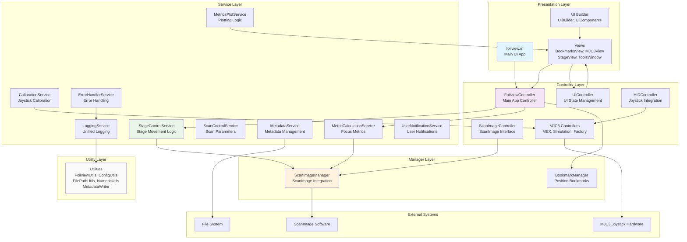
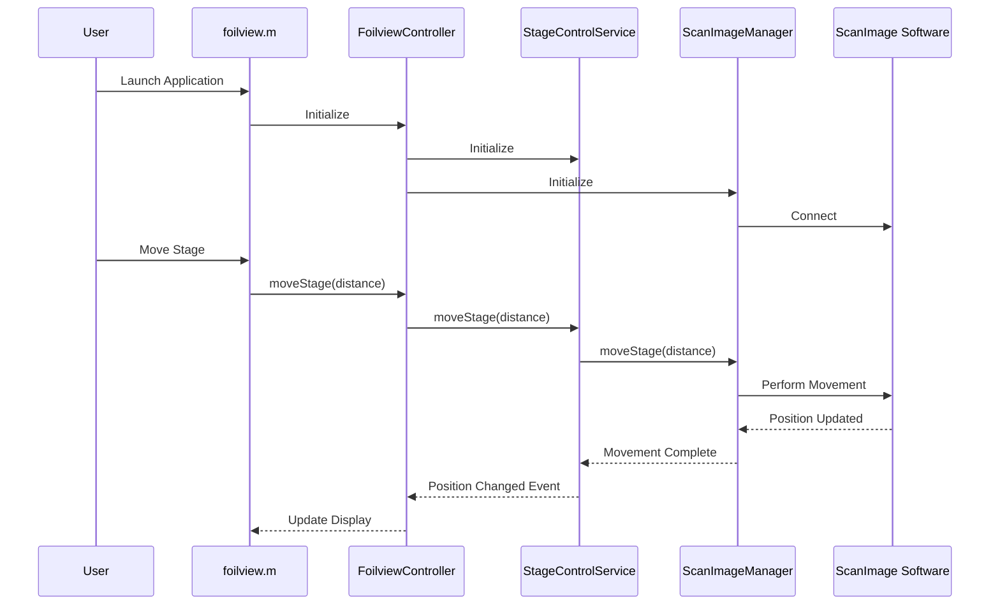
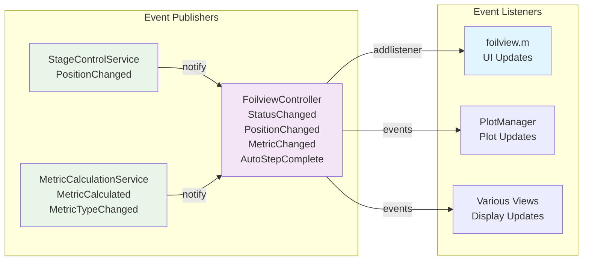
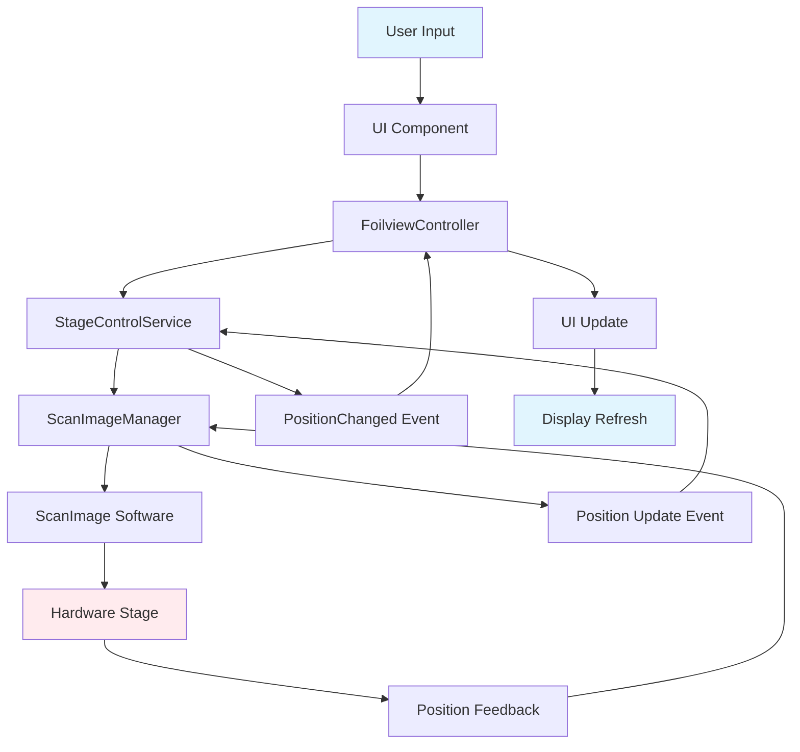
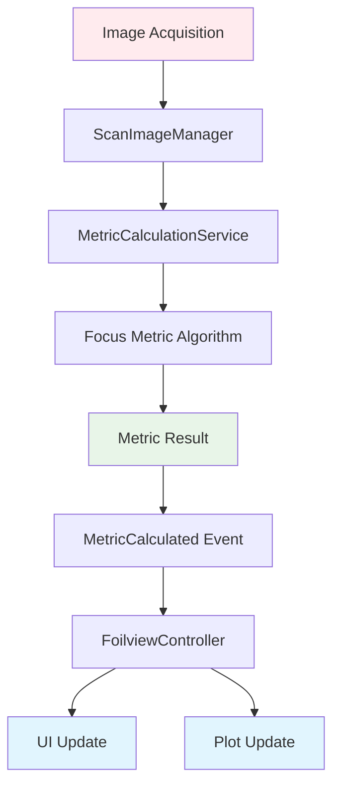
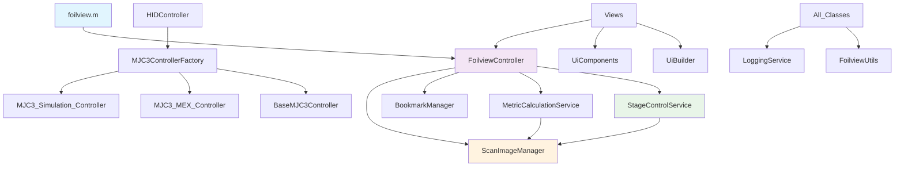
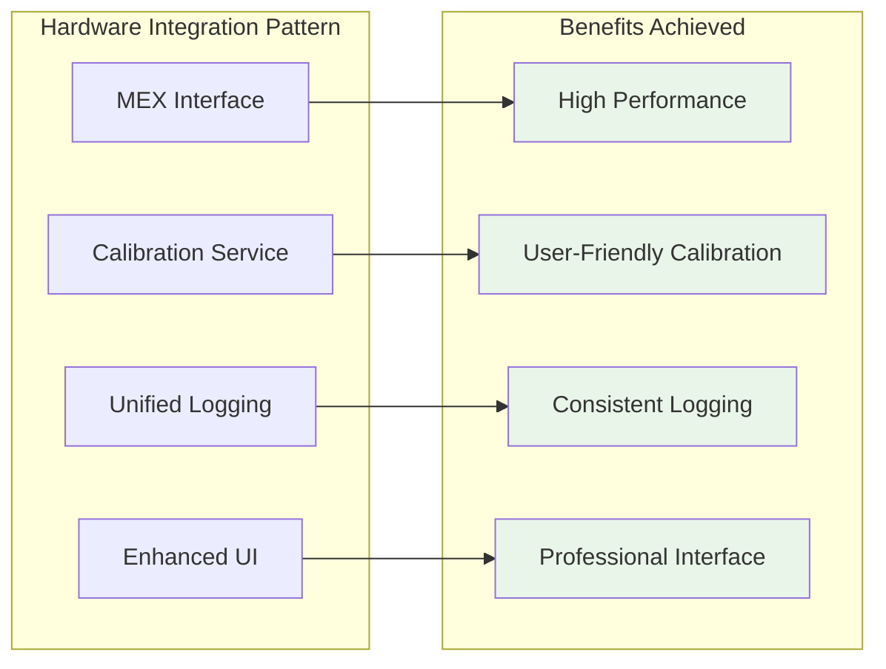

# Foilview Application Architecture

This document provides a comprehensive overview of the current Foilview application architecture, including file structure, component relationships, and data flow patterns.

## Overview

Foilview is a MATLAB-based application for microscope stage control and focus optimization. The application follows a layered architecture with clear separation between UI, business logic, and data access layers.

**Current Status**: The application features a fully functional MJC3 joystick control system with hardware-accelerated MEX interface, comprehensive calibration capabilities, and a unified logging system throughout all components.

## Directory Structure

```
src/
├── foilview.m                    # Main application entry point
├── FoilviewController.p          # Compiled controller (legacy)
├── config/                       # Configuration files (NEW)
│   └── ui_components.json        # ComponentFactory UI definitions
├── controllers/                  # Application controllers
│   ├── FoilviewController.m      # Main application controller
│   ├── HIDController.m           # MJC3 joystick integration
│   ├── ScanImageController.m     # ScanImage interface
│   ├── UIController.m            # UI state management
│   └── mjc3/                     # MJC3 joystick controllers
│       ├── BaseMJC3Controller.m
│       ├── MJC3_MEX_Controller.m
│       ├── MJC3_Simulation_Controller.m
│       ├── MJC3ControllerFactory.m
│       ├── build_mjc3_mex.m
│       ├── install_mjc3.m
│       ├── mjc3_joystick_mex.cpp
│       ├── mjc3_joystick_mex.mexw64
│       └── hidapi.dll
├── managers/                     # Data and resource managers
│   ├── BookmarkManager.m         # Position bookmark management
│   └── ScanImageManager.m        # ScanImage integration
├── services/                     # Business logic services
│   ├── ApplicationInitializer.m  # App startup and initialization
│   ├── CalibrationService.m      # MJC3 calibration
│   ├── ErrorHandlerService.m     # Error handling and logging
│   ├── LoggingService.m          # Unified logging
│   ├── MetadataService.m         # Metadata management
│   ├── MetricCalculationService.m # Focus metric calculations
│   ├── MetricsPlotService.m      # Plotting services
│   ├── ScanControlService.m      # Scan parameter management
│   ├── StageControlService.m     # Stage movement logic
│   └── UserNotificationService.m # User notifications
├── ui/                           # UI architecture components (NEW)
│   └── ComponentFactory.m        # Dynamic UI component creation
├── utils/                        # Utility classes
│   ├── ConfigUtils.m             # Configuration management
│   ├── FilePathUtils.m           # File path utilities
│   ├── FoilviewUtils.m           # General utilities
│   ├── MetadataWriter.m          # Metadata file writing
│   └── NumericUtils.m            # Numeric utilities
└── views/                        # UI components and views
    ├── BookmarksView.m           # Bookmark management UI
    ├── MJC3View.m                # Joystick control UI
    ├── PlotManager.m             # Plot management
    ├── StageView.m               # Camera/stage view
    ├── ToolsWindow.m             # Tools window
    ├── UiBuilder.m               # UI construction (REFACTORED)
    └── UiComponents.m            # UI component definitions
```

## Architecture Layers



## Component Relationships

### Main Application Flow



### Event System



## Key Design Patterns

### 1. Model-View-Controller (MVC)
- **Model**: Services and Managers handle business logic and data
- **View**: UI components in `views/` directory
- **Controller**: Controllers coordinate between Model and View

### 2. Service Layer Pattern
- Business logic encapsulated in service classes
- Services are stateful and handle specific domains
- Clear separation from UI concerns

### 3. Manager Pattern
- Managers handle external system integration
- `ScanImageManager` - ScanImage software integration
- `BookmarkManager` - Position bookmark persistence

### 4. Factory Pattern
- `MJC3ControllerFactory` creates appropriate joystick controllers
- Handles MEX vs Simulation controller selection

### 5. Observer Pattern
- Event-driven architecture using MATLAB's event system
- Services notify controllers of state changes
- Controllers notify UI of updates

## Data Flow Patterns

### Stage Movement Flow



### Metric Calculation Flow



## Current Architecture Issues

### 1. Mixed Responsibilities
- Some controllers handle both business logic and UI state
- Services sometimes have UI dependencies

### 2. Tight Coupling
- Direct instantiation of dependencies
- Hard-coded class references throughout codebase

### 3. Inconsistent Patterns
- Mix of Managers and Services doing similar work
- No clear interface contracts

### 4. Event System Complexity
- Multiple event systems (MATLAB events, custom notifications)
- Potential for circular event dependencies

### 5. Testing Challenges
- Tight coupling makes unit testing difficult
- No dependency injection mechanism
- Hard to mock external dependencies

## File Dependencies

### Core Dependencies



## Recent Architecture Improvements

### MJC3 Joystick System Enhancement (Completed)
**Status**: ✅ **Complete** - Full hardware integration with calibration system

**Key Improvements**:
- **Fixed Positive Twist Bug**: Resolved signed/unsigned value mismatch in CalibrationService
- **Hardware-Accelerated MEX Interface**: 50Hz polling with <1ms latency via compiled C++ MEX function
- **Comprehensive Calibration System**: Per-axis calibration with persistent storage and user-friendly UI
- **Enhanced UI Layout**: Redesigned MJC3View with better organization and color-coded controls
- **Unified Logging Integration**: All components use the centralized LoggingService

**Components Added/Enhanced**:
- `src/controllers/mjc3/mjc3_joystick_mex.cpp` - High-performance HID interface
- `src/services/CalibrationService.m` - Multi-axis calibration with persistent storage
- `src/views/MJC3View.m` - Enhanced UI with calibration controls
- `src/controllers/mjc3/build_mjc3_mex.m` - Automated MEX compilation system

**Technical Achievements**:
- **Real-time Performance**: 50Hz joystick polling with hardware-direct access
- **Cross-platform Compatibility**: Windows/Linux/Mac support via hidapi library
- **Robust Error Handling**: Comprehensive error recovery and user feedback
- **Professional UI**: Intuitive calibration workflow with progress dialogs

### Architecture Pattern Evolution



## Future Architecture Considerations

Based on codebase analysis, potential improvements include:

### 1. Service Consolidation Opportunities
- **System Services**: Combine ErrorHandlerService, LoggingService, and ApplicationInitializer
- **Hardware Services**: Merge StageControlService, ScanControlService, and CalibrationService  
- **Analysis Services**: Combine MetricCalculationService and MetricsPlotService

### 2. Configuration-Driven Architecture
- Replace hard-coded UI layouts with YAML/JSON configuration files
- Implement plugin architecture for hardware components
- Enable runtime component configuration without code changes

### 3. Unified Event System
- Standardize on single event mechanism across all components
- Implement centralized EventBus for loose coupling
- Reduce circular dependencies in event handling

## Summary

The current architecture demonstrates excellent separation of concerns with distinct layers for presentation, business logic, and data access. **Recent improvements** include a fully functional MJC3 joystick system with hardware-accelerated performance, comprehensive calibration capabilities, and unified logging throughout the application.

The MJC3 integration represents a significant architectural achievement, combining low-level hardware access with high-level user interface design. The system demonstrates mature MATLAB development practices with comprehensive error handling, logging, and documentation.

Key architectural strengths:
- **Layered Architecture**: Clear separation between UI, controllers, services, and utilities
- **Hardware Integration**: Professional-grade joystick control with MEX-based performance
- **Unified Logging**: Consistent LoggingService usage across all components
- **Modular Design**: Easy to understand, maintain, and extend
- **Error Resilience**: Comprehensive error handling and recovery mechanisms

The codebase is well-positioned for future enhancements while maintaining its current stability and performance characteristics.