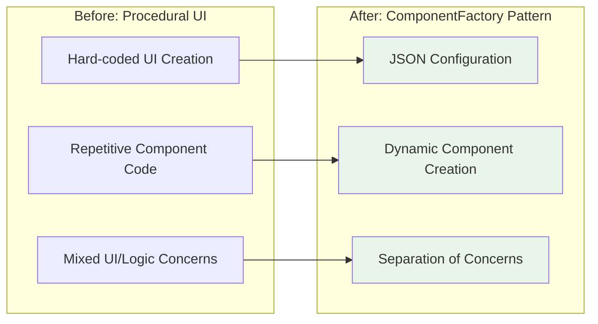

# Foilview Application Architecture

This document provides a comprehensive overview of the current Foilview application architecture, including file structure, component relationships, and data flow patterns.

## Overview

Foilview is a MATLAB-based application for microscope stage control and focus optimization. The application follows a layered architecture with clear separation between UI, business logic, and data access layers.

## Directory Structure

```
src/
├── foilview.m                    # Main application entry point
├── FoilviewController.p          # Compiled controller (legacy)
├── config/                       # Configuration files (NEW)
│   └── ui_components.json        # ComponentFactory UI definitions
├── controllers/                  # Application controllers
│   ├── FoilviewController.m      # Main application controller
│   ├── HIDController.m           # MJC3 joystick integration
│   ├── ScanImageController.m     # ScanImage interface
│   ├── UIController.m            # UI state management
│   └── mjc3/                     # MJC3 joystick controllers
│       ├── BaseMJC3Controller.m
│       ├── MJC3_MEX_Controller.m
│       ├── MJC3_Simulation_Controller.m
│       ├── MJC3ControllerFactory.m
│       ├── build_mjc3_mex.m
│       ├── install_mjc3.m
│       ├── mjc3_joystick_mex.cpp
│       ├── mjc3_joystick_mex.mexw64
│       └── hidapi.dll
├── managers/                     # Data and resource managers
│   ├── BookmarkManager.m         # Position bookmark management
│   └── ScanImageManager.m        # ScanImage integration
├── services/                     # Business logic services
│   ├── ApplicationInitializer.m  # App startup and initialization
│   ├── CalibrationService.m      # MJC3 calibration
│   ├── ErrorHandlerService.m     # Error handling and logging
│   ├── LoggingService.m          # Unified logging
│   ├── MetadataService.m         # Metadata management
│   ├── MetricCalculationService.m # Focus metric calculations
│   ├── MetricsPlotService.m      # Plotting services
│   ├── ScanControlService.m      # Scan parameter management
│   ├── StageControlService.m     # Stage movement logic
│   └── UserNotificationService.m # User notifications
├── ui/                           # UI architecture components (NEW)
│   └── ComponentFactory.m        # Dynamic UI component creation
├── utils/                        # Utility classes
│   ├── ConfigUtils.m             # Configuration management
│   ├── FilePathUtils.m           # File path utilities
│   ├── FoilviewUtils.m           # General utilities
│   ├── MetadataWriter.m          # Metadata file writing
│   └── NumericUtils.m            # Numeric utilities
└── views/                        # UI components and views
    ├── BookmarksView.m           # Bookmark management UI
    ├── MJC3View.m                # Joystick control UI
    ├── PlotManager.m             # Plot management
    ├── StageView.m               # Camera/stage view
    ├── ToolsWindow.m             # Tools window
    ├── UiBuilder.m               # UI construction (REFACTORED)
    └── UiComponents.m            # UI component definitions
```

## Architecture Layers


## Component Relationships

### Main Application Flow


### Event System


## Key Design Patterns

### 1. Model-View-Controller (MVC)
- **Model**: Services and Managers handle business logic and data
- **View**: UI components in `views/` directory
- **Controller**: Controllers coordinate between Model and View

### 2. Service Layer Pattern
- Business logic encapsulated in service classes
- Services are stateful and handle specific domains
- Clear separation from UI concerns

### 3. Manager Pattern
- Managers handle external system integration
- `ScanImageManager` - ScanImage software integration
- `BookmarkManager` - Position bookmark persistence

### 4. Factory Pattern
- `MJC3ControllerFactory` creates appropriate joystick controllers
- Handles MEX vs Simulation controller selection

### 5. Observer Pattern
- Event-driven architecture using MATLAB's event system
- Services notify controllers of state changes
- Controllers notify UI of updates

## Data Flow Patterns

### Stage Movement Flow


### Metric Calculation Flow


## Current Architecture Issues

### 1. Mixed Responsibilities
- Some controllers handle both business logic and UI state
- Services sometimes have UI dependencies

### 2. Tight Coupling
- Direct instantiation of dependencies
- Hard-coded class references throughout codebase

### 3. Inconsistent Patterns
- Mix of Managers and Services doing similar work
- No clear interface contracts

### 4. Event System Complexity
- Multiple event systems (MATLAB events, custom notifications)
- Potential for circular event dependencies

### 5. Testing Challenges
- Tight coupling makes unit testing difficult
- No dependency injection mechanism
- Hard to mock external dependencies

## File Dependencies

### Core Dependencies


## Recent Architecture Improvements

### ComponentFactory Pattern Implementation
**Status**: ✅ **In Progress** - Phase 1 of UiBuilder refactoring

**New Components Added**:
- `src/ui/ComponentFactory.m` - Dynamic UI component creation from JSON configuration
- `src/config/ui_components.json` - Declarative UI component definitions

**Refactored Methods** (3/4 complete):
- ✅ `createPositionDisplay` - 20 lines refactored
- ✅ `createMetricDisplay` - 69 lines refactored (largest method)
- ✅ `createCompactManualControls` - 25 lines refactored
- 🔄 `createAutoControls` - 45 lines (next target)

**Benefits Achieved**:
- **Configuration-driven UI**: Components defined in JSON instead of hardcoded
- **Reduced code duplication**: Common UI patterns centralized
- **Improved maintainability**: UI changes via config files
- **Better testability**: ComponentFactory can be tested in isolation

**Progress Metrics**:
- **Lines Refactored**: 114 of 774 lines (15% complete)
- **Methods Refactored**: 3 of 36 methods (8% complete)
- **Target Reduction**: 774 → 200 lines (74% reduction goal)

### Architecture Pattern Evolution



## Summary

The current architecture demonstrates good separation of concerns with distinct layers for presentation, business logic, and data access. **Recent improvements** include the introduction of a ComponentFactory pattern that enables configuration-driven UI creation, reducing code duplication and improving maintainability.

The ongoing refactoring of UiBuilder.m represents a significant architectural evolution from procedural UI creation to a modern, declarative approach. This improvement addresses several of the identified issues including mixed responsibilities and testing challenges.

The codebase shows mature MATLAB development practices with comprehensive error handling, logging, and documentation. The modular structure makes it relatively easy to understand and maintain, and the recent architectural improvements further enhance the overall design quality.