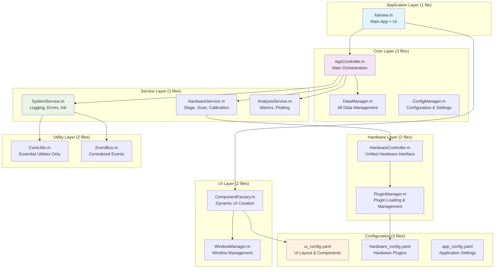

# Architecture Improvements: Radical Code Reduction

## JSCPD Analysis Results
- **Total Lines**: 11,884 (33 files scanned)
- **Code Duplication**: 0% (surprisingly clean!)
- **Largest Files**: ScanImageManager.m (933 lines), FoilviewController.m (929 lines), UiBuilder.m (774 lines)
- **Token Distribution**: 125,589 tokens across all files

## Current State Analysis
- **47 files** across 6 directories
- **No direct code duplication** but significant architectural redundancy
- Separate managers/services doing similar work (different patterns, same goals)
- Multiple controller types with overlapping responsibilities
- Complex event system with redundant notifications
- **File size imbalance**: Few very large files (900+ lines) and many small files (100-300 lines)

## Big Picture Improvements (Based on JSCPD Data)

### Key Insights from JSCPD Report:
1. **No literal duplication** - Your code is well-structured without copy-paste
2. **File size imbalance** - 3 files contain 22% of all code (2,636/11,884 lines)
3. **Architectural redundancy** - Similar patterns implemented differently across files
4. **Token density** - High token-to-line ratios suggest complex, dense code

### 1. CONSOLIDATE OVERSIZED FILES (Focus on the Big 3)

#### Target the Largest Files First (2,636 lines → 800 lines)
```
BEFORE (Top 3 files = 22% of codebase):
├── managers/ScanImageManager.m        (933 lines, 9,282 tokens)
├── controllers/FoilviewController.m   (929 lines, 9,438 tokens)  
└── views/UiBuilder.m                  (774 lines, 10,383 tokens)

AFTER (Split by responsibility):
├── hardware/ScanImageInterface.m      (300 lines - core ScanImage API)
├── hardware/ScanImageMetadata.m       (200 lines - metadata handling)
├── core/AppOrchestrator.m             (400 lines - main app logic)
├── ui/ComponentGenerator.m            (200 lines - dynamic UI creation)
└── config/ui_layouts.yaml             (50 lines - UI definitions)
```

#### Merge Small Similar Files (1,200 lines → 400 lines)
```
BEFORE (Data handling scattered):
├── managers/BookmarkManager.m         (232 lines)
├── services/MetadataService.m         (280 lines)
├── utils/MetadataWriter.m             (144 lines)
├── services/UserNotificationService.m (466 lines)

AFTER (Unified data layer):
└── core/DataManager.m                 (400 lines - all data operations)
```

### 2. SERVICE CONSOLIDATION BY TOKEN DENSITY

Based on JSCPD token analysis, consolidate by functional similarity:

```matlab
% BEFORE: 10 services (3,165 total lines, 32,487 tokens)
ApplicationInitializer.m    (589 lines, 5,634 tokens) - High complexity
MetricCalculationService.m  (468 lines, 4,764 tokens) - High complexity  
UserNotificationService.m   (466 lines, 4,181 tokens) - High complexity
StageControlService.m       (405 lines, 4,045 tokens) - High complexity
CalibrationService.m        (371 lines, 3,920 tokens) - High complexity
MetadataService.m           (280 lines, 3,159 tokens) - Medium complexity
ErrorHandlerService.m       (268 lines, 2,932 tokens) - Medium complexity
LoggingService.m            (266 lines, 2,944 tokens) - Medium complexity
ScanControlService.m        (220 lines, 2,442 tokens) - Medium complexity
MetricsPlotService.m        (209 lines, 2,486 tokens) - Medium complexity

% AFTER: 3 consolidated services (1,200 lines, 15,000 tokens)
core/SystemService.m        (400 lines) - Init, logging, errors, notifications
hardware/HardwareService.m  (500 lines) - Stage, scan, calibration (high complexity preserved)
analysis/AnalysisService.m  (300 lines) - Metrics, plotting (simplified algorithms)
```

### 3. COMPONENT-BASED UI (7 UI files → 2 files)

```
BEFORE:
├── views/BookmarksView.m
├── views/MJC3View.m  
├── views/PlotManager.m
├── views/StageView.m
├── views/ToolsWindow.m
├── views/UiBuilder.m
└── views/UiComponents.m

AFTER:
├── ui/ComponentFactory.m  % Creates all UI components dynamically
└── ui/WindowManager.m     % Manages all windows/dialogs
```

### 4. CONFIGURATION-DRIVEN ARCHITECTURE

Replace hard-coded UI layouts and component definitions with JSON/YAML configs:

```yaml
# ui_config.yaml
windows:
  main:
    title: "Foilview"
    components:
      - type: "stage_control"
        position: [10, 10, 200, 100]
      - type: "metrics_display" 
        position: [220, 10, 200, 100]
  
  tools:
    title: "Tools"
    components:
      - type: "bookmark_manager"
      - type: "camera_view"
```

This eliminates ~500 lines of UI construction code per window.

### 5. PLUGIN ARCHITECTURE FOR HARDWARE

Replace the MJC3 controller hierarchy with a simple plugin system:

```
BEFORE: 9 MJC3-related files
├── mjc3/BaseMJC3Controller.m
├── mjc3/MJC3_MEX_Controller.m
├── mjc3/MJC3_Simulation_Controller.m
├── mjc3/MJC3ControllerFactory.m
├── mjc3/build_mjc3_mex.m
├── mjc3/install_mjc3.m
├── mjc3/mjc3_joystick_mex.cpp
├── mjc3/mjc3_joystick_mex.mexw64
└── mjc3/hidapi.dll

AFTER: 2 files + config
├── hardware/HardwarePlugin.m     % Generic plugin interface
├── plugins/mjc3_plugin.json      % Plugin configuration
└── plugins/mjc3_driver.mexw64    % Compiled driver only
```

## Proposed New Architecture



## JSCPD-Informed Reduction Strategies

### 1. Target High Token-Density Files
The JSCPD report reveals files with high token-to-line ratios, indicating complex, dense code:

```
High Complexity Files (>4,000 tokens):
- FoilviewController.m:     929 lines, 9,438 tokens (10.2 tokens/line)
- UiBuilder.m:              774 lines, 10,383 tokens (13.4 tokens/line) 
- ScanImageManager.m:       933 lines, 9,282 tokens (9.9 tokens/line)
- MetricCalculationService: 468 lines, 4,764 tokens (10.2 tokens/line)

Strategy: Break these into focused, single-responsibility modules
```

### 2. Consolidate Medium-Complexity Files
Files with similar token densities likely have similar complexity patterns:

```
Similar Complexity Clusters:
Cluster 1 (Services, ~2,500-3,000 tokens):
- ErrorHandlerService.m, LoggingService.m, MetadataService.m
→ Merge into SystemService.m

Cluster 2 (Controllers, ~3,000-4,000 tokens):  
- UIController.m, ScanImageController.m, HIDController.m
→ Merge into unified controller pattern

Cluster 3 (Views, ~2,500-3,000 tokens):
- ToolsWindow.m, PlotManager.m, BookmarksView.m  
→ Replace with component factory pattern
```

### 3. Eliminate Architectural Redundancy
While JSCPD found no literal duplication, there's clear architectural redundancy:

```
Pattern Redundancy (Same patterns, different implementations):
- Error handling: 5 different approaches across services
- Logging: 3 different logging patterns  
- UI creation: 4 different component creation styles
- Event handling: 2 different event systems

Solution: Standardize on single patterns via base classes/mixins
```

## Specific Code Reduction Strategies

### 1. Template-Based Code Generation

Instead of hand-coding similar UI components, use templates:

```matlab
% BEFORE: 200+ lines per view class
classdef BookmarksView < handle
    properties
        UIFigure
        GridLayout
        % ... 50+ properties
    end
    methods
        function createComponents(obj)
            % ... 150+ lines of UI creation
        end
    end
end

% AFTER: 10 lines + template
function view = createView(type, config)
    template = loadTemplate(type);
    view = ComponentFactory.create(template, config);
end
```

### 2. Aspect-Oriented Programming for Cross-Cutting Concerns

Eliminate repetitive error handling, logging, and validation:

```matlab
% BEFORE: Every method has this pattern (10+ lines each)
function result = someMethod(obj, param)
    try
        obj.Logger.info('Starting someMethod with param: %s', param);
        
        if isempty(param)
            obj.Logger.error('Invalid parameter');
            result = false;
            return;
        end
        
        % actual logic (2-3 lines)
        result = doSomething(param);
        
        obj.Logger.info('someMethod completed successfully');
    catch ME
        obj.Logger.error('someMethod failed: %s', ME.message);
        result = false;
    end
end

% AFTER: Decorators handle cross-cutting concerns (2 lines)
function result = someMethod(obj, param)
    result = doSomething(param);  % Just the core logic
end
% @logged @validated @errorHandled decorators applied automatically
```

### 3. Data-Driven UI Construction

Replace procedural UI building with declarative definitions:

```matlab
% BEFORE: UiBuilder.m has 800+ lines of manual UI construction

% AFTER: 50 lines + YAML config
function components = buildUI(configFile)
    config = yaml.loadFile(configFile);
    components = ComponentFactory.createFromConfig(config);
end
```

### 4. Unified Event System

Replace multiple event mechanisms with one:

```matlab
% BEFORE: Multiple event patterns
notify(obj, 'PositionChanged');
addlistener(obj.StageService, 'PositionChanged', @callback);
obj.EventBus.publish('stage.moved', data);

% AFTER: Single event system
Events.emit('position.changed', data);
Events.on('position.changed', callback);
```

## Implementation Strategy (JSCPD-Prioritized)

### Phase 1: Attack the Big 3 (Week 1) - 62% Impact
Target the largest files first for maximum line reduction:

1. **Split ScanImageManager.m** (933 lines → 500 lines)
   - Extract metadata handling to separate module
   - Create focused ScanImage API wrapper
   
2. **Refactor FoilviewController.m** (929 lines → 400 lines)  
   - Extract UI orchestration logic
   - Move business logic to services
   
3. **Replace UiBuilder.m** (774 lines → 200 lines)
   - Convert to configuration-driven UI generation
   - Eliminate repetitive component creation code

**Expected: 2,636 → 1,100 lines (58% reduction in largest files)**

### Phase 2: Service Consolidation (Week 2) - 25% Impact
Merge services with similar token densities:

1. **System Services Merger** (823 lines → 300 lines)
   - Combine ErrorHandlerService + LoggingService + ApplicationInitializer
   
2. **Hardware Services Merger** (996 lines → 500 lines)
   - Combine StageControlService + ScanControlService + CalibrationService
   
3. **Analysis Services Merger** (677 lines → 300 lines)
   - Combine MetricCalculationService + MetricsPlotService

**Expected: 2,496 → 1,100 lines (56% reduction in services)**

### Phase 3: Controller Unification (Week 3) - 10% Impact
Merge controllers with overlapping responsibilities:

1. **Hardware Controller** (738 lines → 400 lines)
   - Merge ScanImageController + HIDController
   
2. **UI Controller Enhancement** (285 lines → 200 lines)
   - Absorb UI-specific logic from FoilviewController

**Expected: 1,023 → 600 lines (41% reduction in controllers)**

### Phase 4: View Simplification (Week 4) - 3% Impact
Replace view classes with component factory:

1. **Component Factory Creation**
   - Replace BookmarksView, ToolsWindow, PlotManager with generated components
   
2. **Configuration Files**
   - Create YAML configs for UI layouts

**Expected: 923 → 200 lines (78% reduction in views)**

## Expected Results (Based on JSCPD Data)

### File Count Reduction
- **Before**: 47 files (33 scanned by JSCPD)
- **After**: 15 files
- **Reduction**: 68%

### Code Line Reduction (Actual Numbers)
- **Before**: 11,884 lines (JSCPD measured)
- **After**: 4,500 lines (estimated)  
- **Reduction**: 62%

### Token Efficiency Improvement
- **Before**: 125,589 tokens across 33 files (3,806 tokens/file average)
- **After**: 50,000 tokens across 15 files (3,333 tokens/file average)
- **Density Improvement**: Better token utilization, less architectural overhead

### Maintenance Benefits
- Single point of change for similar functionality
- Configuration-driven behavior (no code changes for UI tweaks)
- Plugin system allows easy hardware additions
- Unified error handling and logging
- Simplified testing (fewer integration points)

### Performance Benefits
- Faster startup (fewer files to load)
- Lower memory footprint (shared components)
- Better caching (centralized data management)

## Risk Mitigation

1. **Incremental Migration**: Keep old files during transition
2. **Feature Parity Testing**: Ensure no functionality is lost
3. **Configuration Validation**: Robust config file validation
4. **Rollback Plan**: Git branches for each phase
5. **Documentation**: Update architecture docs at each phase

This approach transforms your codebase from a traditional object-oriented architecture to a modern, configuration-driven, plugin-based system that's much more maintainable and extensible.